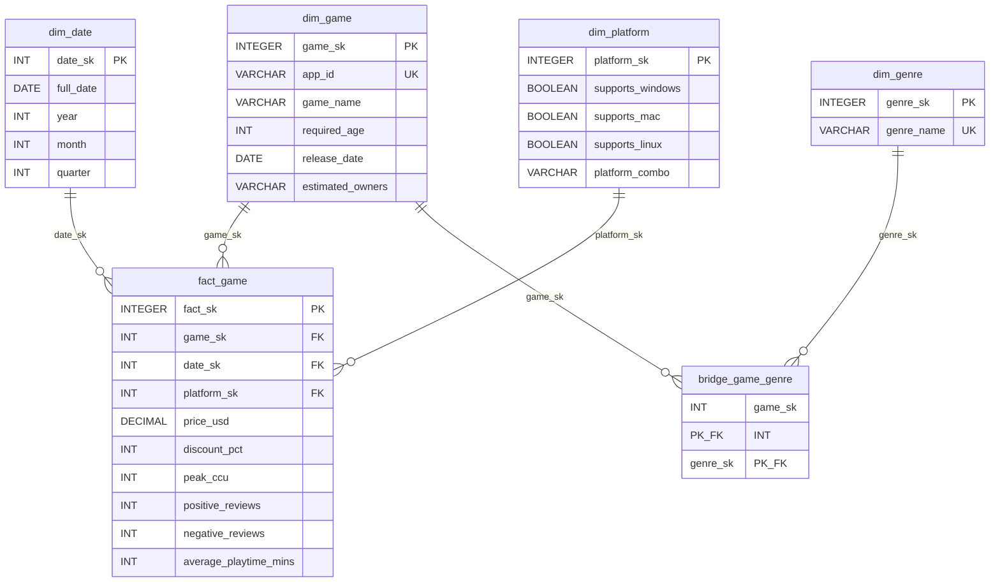

# Steam Scraper

> English usage guide: [USAGE.md](USAGE.md) — a from-scratch walkthrough (setup, all three
> pages, troubleshooting) for anyone not reading Polish. This README stays in Polish since
> it documents the project for its course context.

Mini-hurtownia danych Steam z autogeneracją kodu ETL przez LLM (Gemini). System przyjmuje
ten sam zbiór danych Steam w trzech formatach (CSV, JSON, XLSX), wykrywa format i za każdym
razem zleca modelowi wygenerowanie kodu mapującego dane na wspólny model gwiazdy, aby
porównać, jak LLM radzi sobie z różnymi formatami wejścia.

## Model danych

Schemat gwiazdy w SQLite: `dim_date`, `dim_platform`, `dim_game`, `dim_genre`
(+ `bridge_game_genre`) jako wymiary, `fact_game` jako tabela faktów. DDL i seedy
(`dim_date`, `dim_platform`) w [backend/app/db.py](backend/app/db.py).



Ten sam diagram (plus statystyki liczby wierszy na żywo) jest też renderowany w
aplikacji na stronie `Warehouse` — patrz niżej.

## Uruchomienie — Docker (zalecane, jeden port, bez instalowania Pythona/Node)

Wymaga tylko [Docker Desktop](https://www.docker.com/products/docker-desktop/). FastAPI
serwuje zbudowany frontend (statyczne pliki z `npm run build`) i API pod `/api` — jeden
proces, jeden port (`:8000`).

```bash
copy .env.example .env   # wpisz GEMINI_API_KEY z aistudio.google.com
docker compose up --build
```

Aplikacja pod http://localhost:8000.

### Jedno kliknięcie

- Windows: dwuklik na [start.bat](start.bat) — odpala `docker compose up` w tle i sam
  otwiera http://localhost:8000 w przeglądarce, gdy backend odpowie.
- Mac/Linux: `./start.sh` (lub dwuklik, jeśli ustawione jako uruchamialne w Finderze).

Oba skrypty zakładają, że Docker Desktop jest zainstalowany i uruchomiony oraz że `.env`
z `GEMINI_API_KEY` istnieje w katalogu głównym repo (patrz wyżej). `docker-compose.yml`
montuje `backend/data`, `backend/landing`, `backend/generated_etl` jako bind-mounty, więc
warehouse.db i wygenerowany kod ETL lądują bezpośrednio w repo, nie tylko w kontenerze.

## Uruchomienie — bez Dockera (dev / dwa procesy)

### Backend (FastAPI)

```bash
cd backend
python -m venv .venv
.venv\Scripts\activate
pip install -r ../requirements.txt
copy ..\.env.example .env   # wpisz GEMINI_API_KEY z aistudio.google.com
uvicorn app.main:app --reload --port 8000
```

Endpointy (wszystkie pod `/api`):
- `POST /api/upload` — przyjmuje plik, wykrywa format (csv/json/xlsx), zwraca `file_id`
- `POST /api/etl/run/{file_id}` — generuje kod ETL przez Gemini, wykonuje go w sandboxie
  (do 3 prób z samopoprawianiem na błędach), zapisuje wygenerowany kod do `generated_etl/`
- `GET /api/etl/status/{job_id}` — status/logi/kod danego uruchomienia
- `GET /api/games` — zawartość hurtowni: `fact_game` spłaszczone z jego wymiarami
  (nazwa gry, gatunki, platforma, cena, itd.), pod dashboard
- `GET /api/analytics/dss` — reguły wspomagania decyzji: gry-kandydaci do przeceny
  (dobrze oceniane, bez aktywnego rabatu, cena powyżej średniej) i gry-kandydaci do
  korekty ceny (słabo oceniane, ta sama reszta warunków)
- `GET /api/etl/format-comparison` — właściwe porównanie badawcze: jak LLM radzi sobie
  z generowaniem ETL osobno dla CSV/JSON/XLSX (liczba prób, success rate, najczęstsze
  błędy), agregowane z `generated_etl/` + historii jobów — widoczne też na stronie
  `Upload`
- `GET /api/schema` — metadane schematu gwiazdy (kolumny, klucze, liczba wierszy na żywo)
- `POST /api/sql/query` — konsola SQL tylko do odczytu (SELECT/WITH/EXPLAIN), limit
  500 wierszy i 20s na zapytanie — patrz [backend/app/sql_console.py](backend/app/sql_console.py)
- `DELETE /api/warehouse` — czyści dane hurtowni (dim_game/dim_genre/bridge_game_genre/
  fact_game), zostawia wymiary referencyjne (dim_date/dim_platform)
- `GET /api/gemini-usage` — dzienny licznik wywołań Gemini vs. `GEMINI_DAILY_CALL_BUDGET`
- `GET/POST/DELETE /api/settings/api-key` — klucz API do LLM ustawiany w aplikacji
  (⚙ Settings) ma priorytet nad `GEMINI_API_KEY` z `.env`, bez restartu kontenera —
  patrz [backend/app/api_key_store.py](backend/app/api_key_store.py); GET nigdy nie
  zwraca surowego klucza, tylko źródło (`override`/`env`/`none`) i zamaskowany podgląd

### Frontend (React + Vite + TS)

Wymaga Node.js (nie jest zainstalowany w tym środowisku — zainstaluj lokalnie).

```bash
cd frontend
npm install
npm run dev
```

Dev server na `:5173` proxuje `/api` do backendu na `:8000` (patrz
[frontend/vite.config.ts](frontend/vite.config.ts)) — backend musi wtedy działać osobno.

Strony: `Upload` (drag&drop + wykryty format + porównanie formatów z dotychczasowych
uruchomień), `PipelineRun` (wygenerowany kod + logi wykonania + podsumowanie mapowania
pól od LLM), `Dashboard` (KPI, sygnały DSS, trend cen po roczniku, tabela z zawartością
hurtowni — filtrowanie i sortowanie po kolumnach), `Warehouse` (diagram schematu
gwiazdy z liczbą wierszy na żywo + konsola SQL tylko do odczytu z presetami, historią
i eksportem CSV). W pasku nawigacji dodatkowo ⚙ Settings (klucz API do LLM) i przełącznik
trybu ciemnego.

## Dane wejściowe

- CSV + JSON: [Kaggle "Steam Games Dataset"](https://www.kaggle.com/datasets/fronkongames/steam-games-dataset)
  (`games.csv`, `games.json` — ta sama treść w dwóch formatach).
- XLSX: dokładany osobno (np. tabela kursów walut / słownik gatunków), eksport przez
  `pandas.to_excel()`.

Pobierz zbiór ręcznie z [kaggle.com/datasets/fronkongames/steam-games-dataset](https://www.kaggle.com/datasets/fronkongames/steam-games-dataset)
i wgraj `games.csv` / `games.json` przez stronę Upload w aplikacji — każdy osobno,
żeby porównać jak LLM radzi sobie z każdym formatem.

**Uwaga na rozmiar.** Pełny zbiór to ~400 MB (CSV) / ~930 MB (JSON), realnie
zweryfikowane ~139k gier w wariancie JSON. Wygenerowany kod wykonuje się w osobnym
procesie (nie wątku — patrz niżej) z limitem 240s (`EXEC_TIMEOUT_SECONDS` w
[backend/app/etl_runner.py](backend/app/etl_runner.py)), a kod od LLM nawet przy
grupowaniu zapisów (`executemany`) zwykle robi kilka przebiegów w czystym Pythonie
po każdym wierszu żeby sparsować/znormalizować wartości - to te przebiegi, nie same
zapisy do bazy, dominują czas przy takiej skali. Przy pełnym pliku każda próba może
mimo to skończyć się timeoutem, paląc dzienny limit zapytań do Gemini bez żadnego
efektu. Do testów pipeline'u wytnij najpierw mniejszą próbkę wierszy (np.
`head -300 games.csv > games_sample.csv` w PowerShell/bash, lub `df.head(300)` w
pandas) i wgrywaj tę próbkę zamiast pełnego pliku.

Wykonanie kodu ETL działa jako osobny proces (`multiprocessing`, spawn), nie wątek —
przekroczenie limitu czasu faktycznie zabija proces (`process.terminate()`/`kill()`),
zamiast zostawiać go działającym w tle. Ta sama klasa problemu (wątek + timeout, który
nic realnie nie przerywa) została też znaleziona i naprawiona w konsoli SQL
([backend/app/sql_console.py](backend/app/sql_console.py), przez `conn.interrupt()`).

**Timeout != błąd logiczny.** Zaobserwowane na realnym przebiegu (pełny plik
`games.json`, ~930 MB, ~139k gier): 3 próby pod rząd zakończyły się timeoutem, mimo
że za każdym razem LLM generował inny, sensowny kod — bo domyślny prompt retry
("napraw błąd") nie mówi modelowi, że problem jest w podejściu (pętla Python
wiersz-po-wierszu), nie w konkretnym buggu. Gdy poprzedni błąd to `TimeoutError`,
prompt retry jawnie prosi o wektoryzację i grupowanie zapisów (`executemany`
zamiast pojedynczych `execute()` na wiersz) zamiast ogólnego "napraw błąd" — patrz
`_build_prompt` w [backend/app/llm_etl_generator.py](backend/app/llm_etl_generator.py).
Zweryfikowane na kolejnym realnym przebiegu tego samego ~139k-wierszowego pliku: kod
po tej poprawce faktycznie grupował WSZYSTKIE zapisy do bazy przez `executemany`
(widoczna poprawa) i mimo to nadal przekroczył limit - bo parsowanie/normalizacja
wartości w czystym Pythonie (kilka przebiegów po wszystkich wierszach, zanim
jakikolwiek zapis się wykona) zostaje głównym kosztem, nie same zapisy. Stąd
podniesienie `EXEC_TIMEOUT_SECONDS` do 240s (patrz wyżej) - bezpieczne, bo
przekroczenie limitu faktycznie zabija proces, nie zostawia go działającym w tle.
Sampling wierszy (patrz wyżej) zostaje mimo to zalecany dla najszybszych testów.

Pliki źródłowe wgrywa się przez `/upload`; nie są commitowane (`backend/landing/`
zignorowane w git). Wygenerowany kod ETL per format w `backend/generated_etl/` JEST
commitowany jako artefakt badawczy do porównania między formatami.

**Czyszczenie niekompletnych wierszy.** Po udanym uruchomieniu ETL backend usuwa gry,
którym brakuje któregoś zmapowanego pola (`remove_incomplete_games` w
[backend/app/db.py](backend/app/db.py)) — to NIE dotyczy `discount_pct`/`peak_ccu`
(pola live-service, których część statycznych eksportów Steam po prostu nigdy nie ma).
Jeśli ta reguła usunęłaby 100% właśnie zaimportowanych wierszy, czyszczenie jest
pomijane zamiast po cichu kasować cały import — to był realny bug znaleziony i
naprawiony w trakcie tego projektu (zobacz `skipped_all_incomplete` w wyniku joba).

## Testy

```bash
cd backend
pip install -r ../requirements.txt   # zawiera pytest
pytest
```

Pokrywają deterministyczne części niezależne od LLM/klucza API: wykrywanie formatu
([backend/app/format_detector.py](backend/app/format_detector.py)), walidację
konsoli SQL tylko-do-odczytu i jej faktyczne działanie timeoutu
([backend/app/sql_console.py](backend/app/sql_console.py)), DDL/migrację schematu
i regułę usuwania niekompletnych gier ([backend/app/db.py](backend/app/db.py)),
reguły DSS ([backend/app/analytics_queries.py](backend/app/analytics_queries.py)),
agregację porównania formatów ([backend/app/pipeline_stats.py](backend/app/pipeline_stats.py))
oraz budowę promptu retry (w tym gałąź specjalnie dla timeoutu - patrz niżej) w
[backend/app/llm_etl_generator.py](backend/app/llm_etl_generator.py). Nie wymagają
`GEMINI_API_KEY` ani sieci — same wywołania Gemini (`generate_content`) celowo
zostają poza zakresem testów jednostkowych.

## Otwarte pytania

- Analiza tylko kohort rocznikowych (`release_date`) czy realny time-series ze snapshotów
  Steam Web API / IsThereAnyDeal (wymaga cyklicznego pobierania w czasie trwania projektu).
- Porównanie Gemini vs inny model jako wzmocnienie części badawczej.
